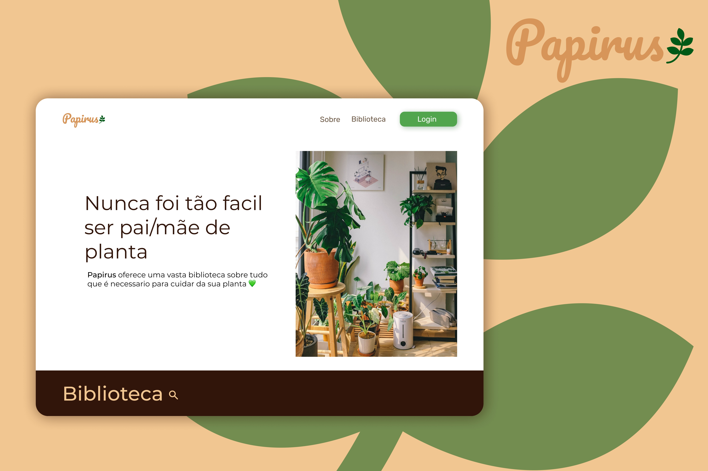

  

# Papirus project

  

## Overview

### The challenge

Users should be able to:
  - Make login in website  
  - Search for any houseplant
  - Mark favorite plants

## My process

### Built with

- [React](https://reactjs.org/) - JS library
- [Next.js](https://nextjs.org/) - React framework
- [Styled Components](https://styled-components.com/) - For styles

### What I learned

## Author

    
    &nbsp;&nbsp;&nbsp;&nbsp;&nbsp;&nbsp;&nbsp;&nbsp;&nbsp;
    
    &nbsp;&nbsp;&nbsp;&nbsp;&nbsp;&nbsp;&nbsp;&nbsp;&nbsp;
    

